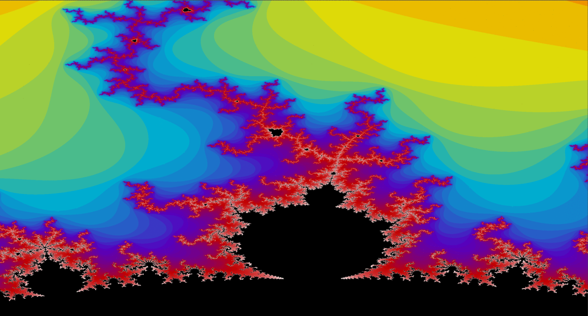

# Propulsion

Welcome user!

Propulsion is a self project aimed at getting a better understanding of Parallel Compute operations. In paticular, this repo is 
based mostly on numerical operations with CUDA and various multi-threaded algorithms. Feel free to make pull requests and 
provide any insight. I am aware of Boost and cuBLAS and in no means is this meant to rival those libraries. This is just 
a way for me to dip my toes in something I've never dabbled with before(in regards to CUDA). 

## Side Goals
I would like to use this to build a neural network from scratch, since Propulsion is built around Matrix Multiply, it isn't that far off
from being highly usable. Currently working on the Tensor class, to allow images to be split for the color channels and N images and what not. 
Would be very cool to get a deep networking with Convolutional Layers.

**Completed** Mandelbrot set. Simple and more advanced implementations of the Mandelbrot set using AVX2 Optimizations and CUDA. You can see some of my results 
for this [here](https://rottenroddan.github.io/#projectsContainer). Below is a GIF of various iterations applied to the same area on the Mandelbrot set.

## Project Status
Ongoing, but has slowed down since my final semester and other current projects. In and out of this project a lot due to other work.

As of April 1st~, my 2080ti can't run under full stress as it creates BOD, therefore there is going to be a delay in continuing this until I get a new GPU.
